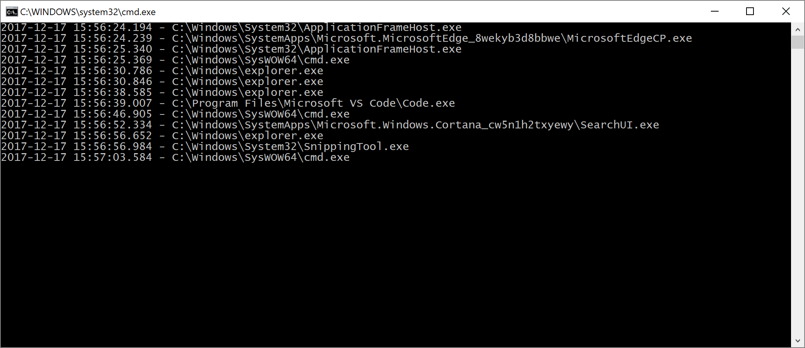

# Find The Stupid Window

Windows API hooking project to log all the windows / UIs with the exact timestamp when they are opened.

 

## Why someone would do this?
Maybe a stupid story but it happend exactly like this...
I was working on my PC and from time to time there was a window poping up.
This window was just showing up some milliseconds till it was gone again.
Just the right time to annoy me but not long enough that I could find out what it is about.
This is why I started this project to determine where this window is coming from and how to get rid of it.

## Is this malware?

I know some Antivirus and Malware protection tools detect this and say it is a suspicious software.
Possibly some malware authors also use API hooking or this technique to do something bad.
But this is truly not the intention of this project.

I just used it to find the popup window which disturbs me from working and that it really doesn't do something evil, you can see if you look on the code :)

## License
[Apache 2.0](LICENSE)
